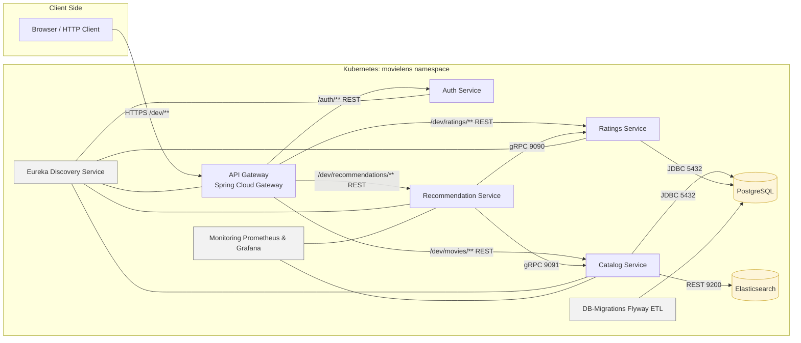
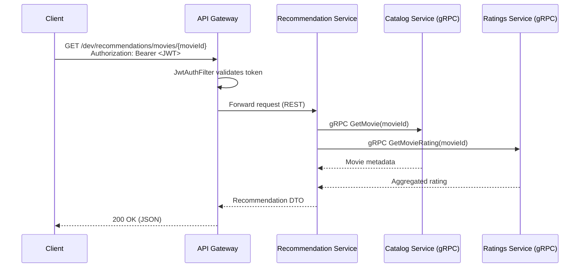
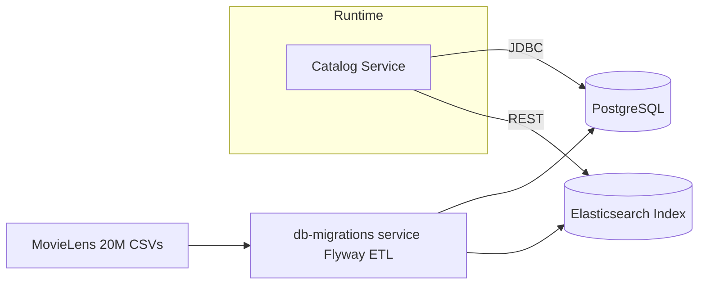

# Movielens Platform – Kotlin Microservices on Spring Boot

> **Short description**  
> A production-style, microservice-based movie catalog & recommendation platform built with Kotlin, Spring Boot, gRPC and a Kubernetes-first deployment model (Helm + Terraform). Uses the MovieLens 20M dataset in PostgreSQL and Elasticsearch for fast full-text search.
> Includes Flyway-based ETL, Prometheus + Grafana monitoring and SonarQube code quality analysis.
---

## 1. High-Level Overview

The platform simulates a real-world **movie recommendation backend**:

- **Catalog Service** – exposes movie metadata (titles, genres, etc.) from PostgreSQL and Elasticsearch.
- **Ratings Service** – manages user ratings and aggregates average scores.
- **Recommendation Service** – composes data from Catalog & Ratings over **gRPC** and exposes recommendations via REST.
- **Auth Service** – issues **JWT tokens** for clients.
- **API Gateway** – a **Spring Cloud Gateway** front door that:
  - authenticates via JWT;
  - routes traffic to the internal services.
- **Discovery Service** – Eureka server for service registration & discovery.
- **PostgreSQL** – primary storage for MovieLens data (movies, ratings, etc.).
- **Elasticsearch** – search index for the movie catalog (prefix/title search).
- **DB-Migrations Service** – Flyway-based database migrations and MovieLens ETL that loads CSV data into PostgreSQL and updates the Elasticsearch index.
- **Monitoring Stack** – Prometheus + Grafana setup for scraping application metrics and visualising service health/dashboards.

The whole system is designed to run **in Kubernetes**, managed via **Helm** and optionally **Terraform** as an IaC wrapper.

---

## 2. Architecture

### 2.1 Microservice Landscape



Key points:

- The **client never talks directly** to downstream services – only to the **API Gateway**.
- **Recommendation Service** is a pure orchestration component:
  - fetches data from Catalog and Ratings over **gRPC**;
  - composes it into a “recommended movie” response.
- **Eureka** provides service discovery; all core services register themselves on startup.
- **DB-Migrations & Flyway** handle schema migrations and initial data load.
- **Monitoring** with Prometheus & Grafana observes catalog and recommendation services.

### 2.2 Request Flow Example: Recommendations



### 2.3 Data & Search Flow

- **PostgreSQL** holds the raw MovieLens tables.
- **Elasticsearch** stores the **search index** for movie titles, enabling:
  - prefix search (e.g. `Toy` → `Toy Story`, `Toy Story 2`, …);
  - scalable full-text queries.



---

## 3. Tech Stack

**Language & Frameworks**

- **Kotlin** for all services
- **Spring Boot**
  - Spring WebFlux (reactive API Gateway & some services)
  - Spring Data (PostgreSQL)
  - Spring Security with JWT
- **Spring Cloud**
  - Spring Cloud Gateway
  - Eureka Discovery

**Communication**

- **REST/HTTP** between API Gateway and services
- **gRPC** between **Recommendation Service** and:
  - Catalog Service (port **9091**)
  - Ratings Service (port **9090**)

**Data & Search**

- **PostgreSQL** – MovieLens 20M dataset
- **Elasticsearch** – full-text search on movie titles
- **Flyway** – schema migrations and MovieLens ETL logic (db-migrations module)

**Infrastructure & DevOps**

- **Docker** – all services packaged as Docker images
- **Kubernetes** – target runtime environment
- **Helm** – chart `infra/helm/movielens` deploys the whole stack
- **Terraform** – optional wrapper to create namespace and apply Helm release
- **Prometheus & Grafana** – metrics scraping and dashboards (monitoring module)
- **Logging** – JSON structured logs (Logback) for easier aggregation

**Quality & Tooling**

- Unit & integration tests (TDD-friendly structure)
- Linting / formatting (e.g. `ktlint`)
- Code coverage (e.g. `JaCoCo`)
- SonarQube – static analysis and quality gates
- CI-ready build (Gradle) and image publishing

---

## 4. Repository Layout

A possible, high-level repository layout:

```text
.
├── api-gateway/                 # Spring Cloud Gateway service
├── auth-service/                # JWT auth & user login
├── catalog-service/             # Movie catalog & search, gRPC server, PostgreSQL + Elasticsearch
├── common-proto/                # Shared .proto definitions for gRPC APIs
├── ratings-service/             # Ratings and aggregates, gRPC server, PostgreSQL
├── recommendation-service/      # gRPC client, composes catalog + ratings into recommendations
├── db-migrations/               # Flyway migrations + MovieLens ETL logic
├── discovery-service/           # Eureka server
├── monitoring/                  # Prometheus & Grafana configuration, dashboards, alerts
└── infra/
    ├── helm/
    │   └── movielens/           # Helm chart for the whole platform
    │       ├── templates/
    │       │   ├── _service-deployment.tpl.yaml
    │       │   ├── _service_service.tpl.yaml
    │       │   ├── api-gateway-deployment.yaml
    │       │   ├── api-gateway-service.yaml
    │       │   ├── auth-deployment.yaml
    │       │   ├── auth-service.yaml
    │       │   ├── catalog-deployment.yaml
    │       │   ├── catalog-service.yaml
    │       │   ├── discovery-deployment.yaml
    │       │   ├── discovery-service.yaml
    │       │   ├── elasticsearch-deployment.yaml
    │       │   ├── elasticsearch-service.yaml
    │       │   ├── postgres-service.yaml
    │       │   ├── postgreas-deployment.yaml
    │       │   ├── ratings-deployment.yaml
    │       │   ├── ratings-service.yaml
    │       │   ├── recommendation-deployment.yaml
    │       │   └── recommendation-service.yaml
    │       └── values.yaml      # default values
    └── terraform/               # Terraform module (where main.tf lives)
        ├── main.tf
        └── values-override.yaml # overrides for Helm values (image tags, etc.)
```

---

## 5. Helm & Terraform: Deployment Model

### 5.1 Helm Chart (infra/helm/movielens)

The **Helm chart** is responsible for deploying:

- movielens namespace resources (optionally)
- all services (Deployments + Services):
  - `discovery-service`
  - `catalog-service`
  - `ratings-service`
  - `recommendation-service`
  - `auth-service`
  - `api-gateway`
- data services:
  - `postgres`
  - `elasticsearch`

Example of **service deployment template** (`_service-deployment.tpl.yaml` – simplified):

```yaml
apiVersion: apps/v1
kind: Deployment
metadata:
  name: {{ .svc.name }}
  namespace: {{ .Values.namespace }}
spec:
  replicas: 1
  selector:
    matchLabels:
      app: {{ .svc.name }}
  template:
    metadata:
      labels:
        app: {{ .svc.name }}
    spec:
      containers:
        - name: {{ .svc.name }}
          image: "{{ .svc.image }}:{{ default .Values.global.imageTag .svc.tag }}"
          ports:
            - containerPort: {{ .svc.port }}
          env:
            - name: SPRING_PROFILES_ACTIVE
              value: "docker"
            - name: EUREKA_CLIENT_SERVICEURL_DEFAULTZONE
              value: "http://discovery-service:8761/eureka/"
```

Service-specific YAML files (e.g. `catalog-deployment.yaml`) simply include this template with the right `.svc` values from `values.yaml`:

```yaml
{{- if .Values.services.catalog.enabled }}
{{- $svc := .Values.services.catalog }}
{{- include "movielens.serviceDeployment" (merge (dict "svc" $svc) .) }}
{{- end }}
```

### 5.2 Terraform Wrapper (infra/terraform)

Terraform is used as a **thin orchestration layer**:

```hcl
terraform {
  required_version = ">= 1.5.0"

  required_providers {
    kubernetes = {
      source  = "hashicorp/kubernetes"
      version = "~> 2.30"
    }
    helm = {
      source  = "hashicorp/helm"
      version = "~> 2.13"
    }
  }
}

provider "kubernetes" {
  config_path = "~/.kube/config"
}

provider "helm" {
  kubernetes {
    config_path = "~/.kube/config"
  }
}

resource "kubernetes_namespace" "movielens" {
  metadata {
    name = "movielens"
  }
}

resource "helm_release" "movielens" {
  name       = "movielens"
  chart      = "${path.module}/../helm/movielens"
  namespace  = kubernetes_namespace.movielens.metadata[0].name
  create_namespace = false

  values = [
    file("${path.module}/values-override.yaml")
  ]
}
```

This gives a **single `terraform apply`** to:

- ensure the `movielens` namespace exists;
- deploy/update the Helm release with consistent values (image tags, etc.).

---

## 6. Running the Platform

### 6.1 Prerequisites

- **JDK** 21+ (for local builds)
- **Docker** (for building images, if you don’t use prebuilt ones)
- **kubectl** (configured to point to your cluster – e.g. `kind`, `minikube`, etc.)
- **Helm** (v3)
- **Terraform** (optional, v1.5+)

### 6.2 Quick Start with Terraform + Helm (recommended)

1. **Start a local cluster** (example with kind/minikube – choose one you like).  
   Make sure `kubectl config current-context` points to the right cluster.

2. **Apply Terraform**:

   ```bash
   cd infra/terraform

   terraform init
   terraform apply
   ```

   This will:

   - create the `movielens` namespace;
   - install the Helm release with your `values-override.yaml` (image tags, etc.).

3. **Check pods**:

   ```bash
   kubectl get pods -n movielens
   ```

   Wait until all pods are in `Running` state.

4. **Expose API Gateway locally**:

   ```bash
   kubectl port-forward -n movielens svc/api-gateway 8099:8099
   ```

5. **Test the API** (see below).

### 6.3 Direct Helm Usage (without Terraform)

If you prefer to use only Helm:

```bash
kubectl create namespace movielens || true

cd infra/helm

helm install movielens ./movielens   -n movielens   -f ../terraform/values-override.yaml   # or your own overrides
```

Then port-forward the API Gateway as above.

---

## 7. Using the API

### 7.1 Authentication Flow

1. **Login** (example endpoint, adapt to your actual controller mapping):

   ```bash
   curl -X POST http://localhost:8099/auth/login      -H "Content-Type: application/json"      -d '{
       "email": "demo",
       "password": "demo"
     }'
   ```

2. Response contains a **JWT token** (e.g. field `token`).

3. Use this token in the `Authorization` header for all subsequent requests:

   ```bash
   export TOKEN="eyJhbGciOiJIUzI1NiIsInR..."
   ```

### 7.2 Search Movies

```bash
curl "http://localhost:8099/dev/movies/search?query=Toy"   -H "Authorization: Bearer $TOKEN"
```

Under the hood:

- API Gateway forwards to **Catalog Service**;
- Catalog Service queries **Elasticsearch** using the `SPRING_ELASTICSEARCH_REST_URIS` configuration.

### 7.3 Get Average Rating

```bash
curl "http://localhost:8099/dev/ratings/movies/1/average"   -H "Authorization: Bearer $TOKEN"
```

- Gateway → Ratings Service → PostgreSQL.

### 7.4 Get Recommendation

```bash
curl "http://localhost:8099/dev/recommendations/movies/6"   -H "Authorization: Bearer $TOKEN"
```

- Gateway → Recommendation Service
- Recommendation Service → (gRPC) Catalog + Ratings
- Response: aggregated JSON DTO with movie & rating info.

---

## 8. Configuration Highlights

### 8.1 Spring Profiles

All services run in Kubernetes with the `docker` profile:

```yaml
env:
  - name: SPRING_PROFILES_ACTIVE
    value: "docker"
```

Make sure your `application-docker.yaml` files configure:

- correct database URL:

  ```yaml
  spring:
    datasource:
      url: jdbc:postgresql://postgres:5432/movielens
      username: movielens
      password: movielens
  ```

- Elasticsearch endpoint:

  ```yaml
  spring:
    elasticsearch:
      rest:
        uris: http://elasticsearch:9200
  ```

- Eureka client configuration:

  ```yaml
  eureka:
    client:
      service-url:
        defaultZone: http://discovery-service:8761/eureka/
  ```

### 8.2 gRPC Ports

In `application-docker.yaml` of the Catalog/Ratings services:

```yaml
grpc:
  server:
    port: 9091       # Catalog Service
```

```yaml
grpc:
  server:
    port: 9090       # Ratings Service
```

And in **Recommendation Service**:

```yaml
catalog:
  grpc:
    host: catalog-service
    port: 9091

ratings:
  grpc:
    host: ratings-service
    port: 9090
```

These hostnames must match the **Kubernetes service names** defined in Helm templates.

---

## 9. Logging & Observability

- Services log using **JSON** format (suitable for log aggregation systems like ELK / Loki).
- Logs include fields like `SERVICE_NAME`, `ENV`, `@timestamp`, etc.
- Example log line from Catalog Service:

  ```json
  {
    "@timestamp": "2025-12-21T17:18:46.049135989Z",
    "message": "Starting catalog gRPC server on port 9091",
    "SERVICE_NAME": "catalog-service",
    "ENV": "docker"
  }
  ```

In addition to structured application logs, the platform also exposes Prometheus metrics and ships with a Grafana setup (in the monitoring/ module) to visualise service health and basic dashboards.

---

## 10. Summary

This project demonstrates a **complete microservice ecosystem** around a realistic dataset:

- Kotlin + Spring Boot microservices;
- REST + gRPC communication;
- PostgreSQL & Elasticsearch data/search stack;
- Flyway-based migrations and ETL with a dedicated db-migrations service;
- secured with JWT via a dedicated Auth service;
- fronted by a Spring Cloud API Gateway;
- monitored with Prometheus + Grafana;
- analysed with SonarQube for code quality;
- deployed to Kubernetes via Helm, orchestrated by Terraform.

It’s a strong portfolio piece for backend / platform engineering roles, showing both **application architecture** and **infrastructure-as-code** skills.
